<style>
svg[id^="mermaid-"] { min-width: 200px; max-width: 700px; }
.in > circle { fill:#2f2 !important;stroke:#ccc  !important; }
.st > circle { fill:#000 !important;stroke:#f22 !important; stroke-width:4px !important; }
.tr > rect { fill:#888 !important;stroke-width:0pt !important; }
.note > rect { fill: #f9f3c4 !important; stroke: #c7ba00 !important; }
g > polygon { fill:#8f8 !important;stroke:#000 !important;stroke-width:1pt !important; }
h2 { margin-top: 2.5rem; }
</style>


All diagrams were generated with mermaid-js -- <https://mermaid-js.github.io/mermaid-live-editor>.

The goal of this questions is not to bring issues or alternative designs, but to clarify and make choices over the design (even if not optimal ones), most likely following the conventions guided by Enterprise Architect.

## Loops with temporary artefacts


<!-- 
```plantuml
@startuml
partition Activity {
   (*) --~> A1
    A1 --~> A2
    A1 --~> === T1 ===
       ..> A2
    if "more?" then
      --~>[yes] A1
    else
      --~>[no] (*) 
    endif
}
=== T1 === ..> out
@enduml
```
-->

The question raised here (by Ruppert) was if there is a compact way of only sending the last artefact to `out` when the loop is exited. For example, a variation of the diagram below.


Another variation example below.


__Conclusions:__
A new `sync bar` is planned to be introduced, mixing sequence- and artefact-flows, whereas all input sequences and artefacts must be present for the `bar` to be active.
If 3 artefacts are produced by A1 in the loop, only 1 artefact should go to `out`.
I guess this should not specify how artefacts are collected by the last `fork` while waiting for it to become active.
(More on the `sync bar` further below.)


## Dependency vs. instantiating

Below, can if A1 is done 5 times, does A3 also has to be done 3 times?
Can A3 be done 3 times?


__Conclusions:__
It is ambiguous on whether `A3` should be executed multiple times or one time.
This is therefore a ill-designed flow, and should be avoided.

## Multiplicity

Is any of the following allowed?

```mermaid
graph TD
    Init(( )):::in --> Tr0[ ]:::tr
    Tr0 --> W1a([A1]) & W2a([A2])

    W1c([A1]) --> T1[ ]:::tr
    W2c([A2]) --> T1
    T1 --> St(( )):::st

    T2[ ]:::tr --> W1d([A1]) & W2d([A2])
    W1d --> St1(( )):::st
    W2d --> St2(( )):::st

    W1e([A1]) & W2e([A2]) --> merge{ }:::gw
    merge --> W3e([A3])

    Init2(( )):::in --> W4([A1])
    W5([A2]) --> St5(( )):::st
    W4 -.- W5
    linkStyle 15 stroke:white;
classDef in fill:#2f2,stroke:#ccc;
classDef st fill:#000,stroke:#f22,stroke-width:4px;
classDef tr fill:#888,stroke-width:0pt;
classDef gw fill:#8f8,stroke-width:1pt,stroke:#000;
```




__Conclusions:__
(1) and (3) are not ok - a `fork` or `gateway` should be used in both cases.
(2) and (4) are ok, and semantically equivalent to the use of a `gateway` (in case this becomes valid syntax).
(5) annd (6) are not supported yet but ok; (5) is equivalent to have 2 start nodes, one for each activity.
(7) is a bit strange but ok (would be better with a `gateway` instead of `fork`.)
(8) is not supported yet, but ok (and equivalent to (2)).
(9) is not valid, since all activities must have an incoming (sequence) arrow (__Suggestion:__ syntactic sugar - no incoming arrow is interpreted as an arrow from the start node).

---

Will both the artefact from A1 and A2 below go to Out?


__Conclusions:__
This is a source of long unproductive discussions.
This seems ok, and desirable if A1 and A2 produce the same kind of artefacts, better supporting a modular development. I.e., allowing this method to be replaced by an equivalent one that uses different activities.
In many cases we want to distinguish the output of A1 and A2, where we should produce 2 different outputs.

A similar discussion is on whether internal artefacts are allowed or if all should be made public. I prefer the former (more modular).


## Small DSL metamodel comments

Some doubts of possible imprecisions in the DSL metamodel (Fig. 8 in the [handbook](https://risecloud.sharepoint.com/:w:/r/sites/VALU3S-general/_layouts/15/Doc.aspx?sourcedoc=%7BBD04EF21-B815-49FE-8C5C-724089C0CAD7%7D&file=V%26VML_Handbook.docx&action=default&mobileredirect=true)).

 - A `method` does not seem to be able to own a reference to another `method`. In the examples there is a special `activity` that can `call/invoke` another `method`. This seems to be missing from the metamodel. Also, it is not clear if these calls can be recursive - I'm guessing that they should not, and have only explicit loops as a mechanism for repetition.
 - A `gateway` cannot be connected to another `gateway`, but I recall examples where this was the case. Should it be?
 - A `gateway` cannot be connected to a `ForkNode` (and vice-versa), but an example allows this (Fig. 9, where sequence arrows are also mistakenly used).
 - Maybe the multiplicity of ArtefactFlow and SequenceFlow could be included? (I'm not sure this is valid UML). For example, to clarify how many inputs/outputs can `gateways` have. Maybe clarifying some of my "Multiplicity" questions above.
 - A `ForkNode` cannot be connected to another `ForkNode`, but the examples suggest it can. Should it be?
 - The DSL suggests that a single `ForkNode` can have any combination of `SequenceFlows` and `ArtifactFlows` going in and out. Maybe having different forks for Sequence and for Artifacts could provide more refined syntactic restrictions.


## Sync bar

There was a discussion to __generalise Fork/Joins__ to so-called __sync bars__ to allow a combination of many `ArtifactFlows` and `SequenceFlows`  both as input and output. Traditional `ForkNode` were meant to have 2 inputs and 1 output or vice-versa, and without mixing `ArtifactFlows` and `SequenceFlows`.
Sync bars should replace the traditional `ForkNodes`, since they do not break their semantics.

### Interpretation 1: merge and replicate
My interpretation of sync bars below.


In the example above the __sync bar__ will only be _active_ when `1` and `2` are triggered, triggering `5` and `6`. Once it is _active_, any artifact from `3` or `4` sent to the bar is replicated to both `8` and `9`.


### Interpretation 2: associate inputs to outputs
Another interpretation, suggested by Herzner, is to use the names of artifacts to associate incoming arrows to output arrows with the same name.
The picture below illustrates this.


In this example there are 2 artifact names: `art-1` and `art-2`. After `1` fires the bar becomes active. Then:

 - both incoming artifacts named `art-1` are forwarded to the outgoing artifact `art-1`, 
 - the incoming artifact `art-2` is replicated to both outgoing artifacts named `art-2`.

The merging behaviour of `art-1` is still not clear: it could either (1) send any of the incoming artifacts to the outgoing ones, or (2) it could aggregate/combine the incoming artifacts before sending them. Option (2) would require all incoming artifacts to be present before sending an artifact, and option (1) would only require 1. I believe that option (1) is more natural, but this could anyway lead to confusions.


## Inspiration in PlantUML's syntax?

When browsing through PlantUML's new syntax for Activity Diagrams, I saw some restrictions in the syntax. E.g., loops can only be built via specific constructs (so no mutual recursion is possible).

- <https://plantuml.com/activity-diagram-beta>

They also use a hexagon for "activity + choice", as suggestion in a meeting for syntactic sugar, which supports the adoption of this syntax.


## Valid traces


__Conclusions:__
Invalid flow, because all activities must have an entry point.


__Guess:__
A3 will be stopped or ignored once the method stops. If A3 produces artefacts, these will be ignored after stopping.


__Guess:__
Forks do not seem to be able to connect to each other yet, but I guess they could and will.
<!-- When mixing sequence- and artefact-flows it could get more complicated, e.g., assuming an artefact could -->


## Mandatory artefacts

The interplay between artefacts and sequence flow seems something relatively new. It would be good to have this interplay precise in a useful way.


__Guess:__
It should be ok for A3 to start before A2 (artefacts should not be mandatory to start (or to finish)).
A refined scenario follows below, unfolding a possible A3.


If we want to observe `send` and `get` of artifacts:


__Suggestion:__
Distinguish _optional_ from _mandatory_ (input) artifacts, using some new syntax for that, allowing flows to be also controlled by artifacts.

__Guess:__
As before, I think it should be ok for A3 (and A3a) to start before A2.

## State & evolution of a workflow

The __state__  could be a tuple of:

 - Set of _active_ activities
 - (Set of _finished_ activities)
 - (Set of input artefacts available (relevant?))

An activity becomes __active__ when:

 - one of its dependencies _finishes_
 - it is a starting activity (in the beginning)

A __step__ of a workflow can be:
 
 - A.start
 - A.stop
 - A.art.write
 - A.art.read

<!-- 
```plantuml format="png" classes="uml myDiagram" alt="My super diagram placeholder" title="My super diagram" width="300px" height="300px"
  Goofy ->  MickeyMouse: calls
  Goofy <-- MickeyMouse: responds
```

```plantuml
  Goofy ->  MickeyMouse: calls
  Goofy <-- MickeyMouse: responds
```

```plantuml
@startuml
(*)  --~> "check input"
If "input is verbose" then
--~> [Yes] "turn on verbosity"
--~> "run command"
else
--~> "run command"
Endif
--~>(*)
@enduml
```
-->

<!-- https://mermaid-js.github.io/mermaid-live-editor/edit#eyJjb2RlIjoiZ3JhcGggTFJcblxuICBzdWJncmFwaCBUT1BcblxuICAgIEluaXQgLS0-IFcxKFtXb3JrMV0pXG4gICAgVzEgLS0-IFcyKFtXb3JrMl0pXG4gICAgVzEgLS4tPiBUMVsgXTo6OnRyXG4gICAgVDEgLS4tPiBXMlxuICAgIFcyIC0tPiBtb3Jle21vcmU_fTo6Omd3XG4gICAgbW9yZSAtLXllcy0tPiBXMVxuICAgIG1vcmUgLS1uby0tPiBTdG9wXG5cblxuICAgIEluaXQoKCApKTo6OmluO1xuICAgIFN0b3AoKCApKTo6OnN0O1xuICBlbmRcbiAgVDEgLS4tPiBvdXRcblxuXG5cbmNsYXNzRGVmIGluIGZpbGw6IzJmMixzdHJva2U6I2NjYztcbmNsYXNzRGVmIHN0IGZpbGw6IzAwMCxzdHJva2U6I2YyMixzdHJva2Utd2lkdGg6NHB4O1xuY2xhc3NEZWYgdHIgZmlsbDojODg4LHN0cm9rZS13aWR0aDowcHQ7XG5jbGFzc0RlZiBndyBmaWxsOiM4Zjgsc3Ryb2tlLXdpZHRoOjFwdCxzdHJva2U6IzAwMDtcbiIsIm1lcm1haWQiOiJ7XG4gIFwidGhlbWVcIjogXCJkZWZhdWx0XCJcbn0iLCJ1cGRhdGVFZGl0b3IiOnRydWUsImF1dG9TeW5jIjp0cnVlLCJ1cGRhdGVEaWFncmFtIjp0cnVlfQ

So? -->