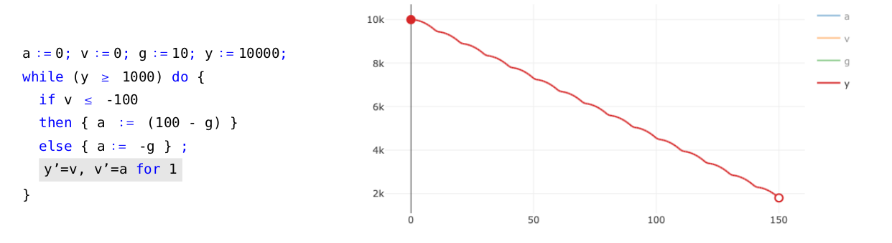
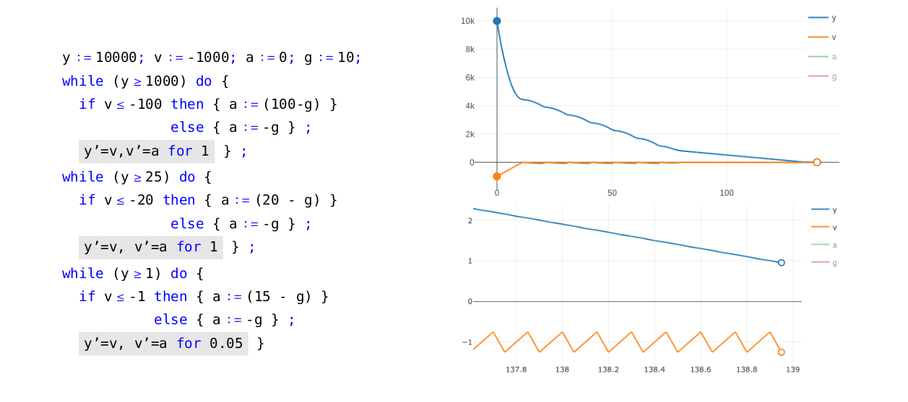
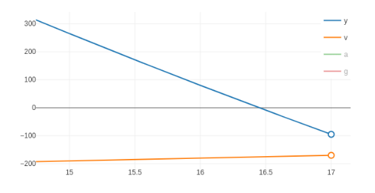
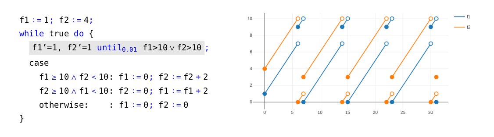

_(Original article published in [Medium](https://inesctec.medium.com/programs-for-the-physical-world-describing-vehicles-and-fireflies-d4eaaf4ebd2e) via [INESC TEC](https://inesctec.medium.com/))_

# 1. Two (apparently) different problems

### Space exploration
Consider the following scenario: a _spacecraft_ is descending with high velocity into a planet, and it needs to land _smoothly_ by means of a vertical thrust vector. The spacecraft has delicate equipment inside so the maximum acceleration of the thrust vector is restricted to e.g. ${\small 100m/s^2}$ (roughly, the maximum acceleration force that a jet fighter pilot can be subjected to). Real-time communication with the spacecraft is unfeasible and therefore the landing process needs to be completely autonomous, more specifically managed by a _software controller_ linked to altitude sensors and thrust pedals.

The scenario just described is critical to _unmanned space exploration_ — two recent, important examples of this are [NASA Perseverance Rover’s descent to Mars](https://www.youtube.com/watch?v=rzmd7RouGrM) (a few weeks ago) and [SpaceX Starship Programme](https://www.youtube.com/watch?v=_qwLHlVjRyw) whose descent process additionally requires a proper _rotation_ of the ship to direct the thrust vector to the ground.

### Biological mechanisms.
Let us now consider an apparently very different scenario. Every _firefly_ has an internal clock that helps it to know when to flash: when the clock reaches a threshold (say, 10 seconds) the firefly flashes and the clock’s value is _reset to zero_. Additionally, if other fireflies are nearby then they try to synchronise their flashes in a _decentralised_ way (i.e. there is no central entity orchestrating the fireflies’ clocks). Decentralised synchronisation is a well-known issue in software engineering, so it is appealing and instructive to see how Nature handles the same problem.

Previous observations of how fireflies interact with one another lead to the proposal of a simple algorithm for _modelling_ the fireflies’ synchronising behaviour [1, 8]: the idea, in a nutshell, is that the flash of a firefly increments the internal clock’s value of all other fireflies nearby. _How precise is the proposed algorithm w.r.t. to the fireflies’ actual behaviour? And how well does the fireflies’ synchronisation strategy work?_

# 2. Hybrid Programming

Despite looking drastically different, the scenarios presented above _share notable features_: both critically involve some form of continuous, physical process (e.g. altitude in the first case; time in the second one). Also, both tacitly involve typical patterns of programming: in the first case, some form of while-loop is necessary to tell when to turn off/on the thrust vector; in the second case, a notion of internal value and discrete change is necessary to model the fireflies’ synchronisation process. Systems with such features are traditionally qualified as _hybrid_ to emphasise that they intermix _continuous_, physical processes with _discrete_, digital computation [6, 5, 7].

Hybrid programming is a rapidly emerging computational paradigm that aims at using principles and techniques from programming theory to study or engineer hybrid systems (such as the ones above). In contrast to standard programming (and as hinted before), it involves not only classical constructs (e.g. while-loops, conditionals, etc) but also _differential_ constructs, which are used for describing physical processes such as velocity, movement, energy, and time. This cross-disciplinary combination has a notably wide range of application domains, from predicting the propagation of diseases [4] and developing personalised treatments against cancer [3] to studying complex physical models and even engineering district-wide electric grids [6, 5].

> At [INESC TEC (HASLab)](https://www.inesctec.pt/en/centres/haslab) and [CISTER](https://cister-labs.pt) we are currently studying the mathematical foundations of hybrid programming — an important step to establish a rigorous discipline of hybrid systems, with all the implications expected for an area with so many application domains. In this article, we briefly present one of our contributions in the area: a simple hybrid programming language and a corresponding simulation tool (Lince) — together these allow to rapidly prototype and subsequently study different classes of hybrid systems.

# 3. Simulating Hybrid Programs via Lince

Let us go back to the basics of programming theory. A core foundation of imperative programming is a language with the following constructs:

<!--  -->

<!-- 

$  p,q \; \, \ni \, \; x\,:=\,t
    ~\mid~ p \,;\, q ~\mid~
    ~$if$~ b
    ~$then$~  p
    ~$else$~  q
    ~\mid~
    ~$while$~  b~p
$

 -->

$$  p,q   \ni   x:=t
    ~\mid~ p ~;~ q ~\mid~
    \textcolor{blue}{\textsf{ if }} b
    \textcolor{blue}{\textsf{ then }}  p
    \textcolor{blue}{\textsf{ else }}  q
    ~\mid~
    \textcolor{blue}{ \textsf{while } }  b~p
$$

where $x ∶= t$ is the usual assignment construct and b is a Boolean condition. In order to address hybrid systems, we need to extend this language with some mechanism representing the evolution of a physical process, e.g. the change in altitude of the spacecraft (Section 1). The evolution of physical processes is standardly modelled by systems of differential equations. For example, the system $y' = v, v’ = a$ dictates that the altitude ($y$) of the spacecraft changes according to its velocity ($v$) and that its velocity changes according to its acceleration ($a$). Adding to this, the software engineer will probably require that the controller embedded in the spacecraft periodically reads the current altitude, does some computation, and then idles for a while before repeating the same process. In other words, there will be periods in time in which the computer is idle but physical processes are evolving. Hence, we consider the following differential statement,

<!-- 

  $x’_1 = t_1, \ldots , x'_n = t_n$ for $d$

 -->

$$
x’_1 = t_1, \ldots , x'_n = t_n \textcolor{blue}{\textsf{ for }} d
$$

which represents the evolution of a physical process for d time units: such a differential statement can be read as “run the system of differential equations $x’_1 = t_1, \ldots , x'_n = t_n$ for $d$ time units and keep the computer idle meanwhile”. This is the only ingredient to be added to the previous language. Notwithstanding it will be sufficient for modelling a myriad of hybrid systems. Consider, for example, the hybrid program presented in Figure 1. Intuitively, it is a while-loop that runs whilst the altitude of the spacecraft is not below 1${\small km}$ (at the start of each iteration). In more detail, at each iteration the controller reads the current velocity and depending on the value read it uses the thrust vector $(a ∶= 100 − g)$; subsequently, the altitude and velocity of the spacecraft evolves for one time unit $(y’= v, v’ = a$ for $1)$. The value g represents the force of gravity. Note also the altitude’s trajectory (Figure 1 on the right, calculated by Lince) corresponding to this hybrid program: the spacecraft is indeed descending and, interestingly, in a wave pattern (the latter caused by turning on/off the thrust vector periodically). The wave pattern suggests that the algorithm has room for improvement regarding fuel efficiency.

Figure 1. Simple example of a hybrid program (on the left) and corresponding trajectory (on the right).

In classical programming theory, small-step operational semantics is a standard, rigorous mechanism for listing in order all computational steps performed by a given program. Such a semantics is very useful for, among other things, guiding the implementation of compilers and interpreters. This naturally gives rise to the following question: Can we equip the previous hybrid programming language with a small-step operational semantics? This is the question that we positively answer in [2]. In the same reference this semantics was used to implement the Lince interpreter.

As we further illustrate next, Lince is a practical framework to formally specify and analyse hybrid programs, such as the spacecraft descent process and the firefly synchronisation system, presented in Section 1. Actually Lince’s lightweight nature allows to very quickly make a prototype of ideas underlying a hybrid program and then test them under different scenarios, which facilitates the detection of design errors at an early development stage. Let us see it at work.

## 3.1 The spacecraft and its descent into a planet

First, let us go back to the example of the spacecraft. Recall that we wish to land safely on a planet by means of a thrust vector with limited power. Assume then that the descent process starts at 10${\small 𝑘𝑚}$ of altitude with an initial velocity of 3600${\small km/h}$ (i.e. 1000${\small m/s}$). For simplicity, we consider a constant gravitational pull g and assume that the planet has no atmosphere (no friction forces are involved). We divide the task of landing safely into three smaller ones in the form of while-loops, as presented in Figure 2. Each of these sub-tasks corresponds to a different stage of the descent process, marked by the altitude of the spacecraft: the first sub-task is active whilst at an altitude equal or above 1${\small 𝑘𝑚}$ (1000${\small 𝑚}$); the goal is to rapidly decrease the spacecraft’s velocity by applying the maximum thrust force. The third sub-task becomes active when the controller detects that the current altitude is lower than 25${\small 𝑚}$; at this point the computer controls the descent much more precisely and uses much less thrust force. The second task serves as a transition between the two previous ones, allowing to correct possible deviations from the starting altitude and velocity. The corresponding execution for this hybrid program (obtained via the aforementioned small-step semantics) is presented in Figure 2 (on the right). A natural question to ask is whether our program is robust against higher starting velocities. We can test this in Lince: changing the starting velocity to e.g. 4500${\small km/h}$, we can observe in the tool that the spacecraft is still going to survive the descent. However, if we slightly increase the velocity up to e.g. 4680${\small km/h}$ then the spacecraft will crash at high speed (Figure 3).

Figure 2. A hybrid program for the spacecraft’s descent (on the left), corresponding trajectory (on the top right) and a zoomed in version of the latter when close to the ground (on the bottom right).

Figure 3. Spacecraft crashing with a velocity around 720${\small km/h}$ as a consequence of increasing the initial velocity to 4680${\small km/h}$.

## 3.2 The fireflies’ synchronisation strategy

For a second illustration, recall the fireflies’ synchronisation strategy described in Section 1. For this example, we will benefit from using some syntactic sugar, namely the expression,

$$  x'_1 = t_1,\ldots,x'_n = t_n
    ~\textcolor{blue}{\textsf{until}_b}~
    b
$$

as an abbreviation of the program $\textcolor{blue}{\textsf{while }} (\textsf{not}~b) \textcolor{blue}{\textsf{ do }} \{ x'_1 = t_1, \ldots , x'_n = t_n \textcolor{blue}{\textsf{ for }}d \}$. Intuitively, the latter program reads as "run the system of differential equations $x'_1 = t_1, \ldots , x'_n = t_n$ until condition $b$ becomes true”. However, note the existence of an underlying problem of precision: the program may not halt as soon as condition b becomes true, worse it may not halt at all if condition $b$ is true only for a very brief interval (the degree of precision is given by the value $d$). Unfortunately, it is impossible to completely avoid this problem because computational simulations are inherently limited to a finite precision. We do not further describe this issue here, but the curious reader will find more details in [2].

Consider now two fireflies $f_1$ and $f_2$. The evolution of their internal clocks is represented by the differential statement:

<!-- 

$  f'_1 = 1, f'_2 = 1
    ~$until$_{0.01}~
    f1 > 10 \lor f2 > 10
$

 -->

$$ f'_1 = 1, f'_2 = 1
    ~\textcolor{blue}{\textsf{until} _{0.01}}~
   f1 > 10 \lor f2 > 10
$$

i.e. their internal clocks increase at the expected rate of 1 until one of the fireflies is ready to flash. Following [1, 8], when any of the fireflies flashes the other adds, say, two time units to its internal clock. We thus obtain the hybrid program presented in Figure 4. The case statement allows us to identify what made the differential statement to halt: either firefly 1 flashed, or firefly 2 flashed or both did. The execution corresponding to this hybrid program is presented in Figure 4 (on the right), where we can see that indeed the two fireflies approximate their flashes in time.

Figure 4: Description and simulation of the internal clocks of two fireflies.

### References
[1] Rafal Goebel, Ricardo G Sanfelice, and Andrew R Teel. Hybrid dynamical systems. IEEE Control Systems, 29(2):28–93, 2009.

[2] Sergey Goncharov, Renato Neves, and José Proença. Implementing hybrid semantics: From functional to imperative. In International Colloquium on Theoretical Aspects of Computing, volume 12545 of Lecture Notes in Computer Science, pages 262–282. Springer, 2020.

[3] Bing Liu, Soonho Kong, Sicun Gao, Paolo Zuliani, and Edmund M Clarke. Towards personalized prostate cancer therapy using delta-reachability analysis. In Proceedings of the 18th International Conference on Hybrid Systems: Computation and Control, pages 227–232. ACM, 2015.

[4] Xinzhi Liu and Peter Stechlinski. Infectious Disease Modeling. Springer, 2017.

[5] Renato Neves. Hybrid programs. PhD thesis, Minho University, 2018.

[6] André Platzer. Logical Analysis of Hybrid Systems: Proving Theorems for Complex Dynamics. Springer, Heidelberg, 2010.

[7] Kohei Suenaga and Ichiro Hasuo. Programming with infinitesimals: A while-language for hybrid system modeling. In International Colloquium on Automata, Languages, and Programming, volume 6756 of Lecture Notes in Computer Science, pages 392–403. Springer, 2011.

[8] Alexander Tyrrell, Gunther Auer, and Christian Bettstetter. Fireflies as role models for synchronization in ad hoc networks. In Proceedings of the 1st International Conference on Bio Inspired Models of Network, Information and Computing Systems, BIONETICS ’06, New York, NY, USA, 2006. Association for Computing Machinery.